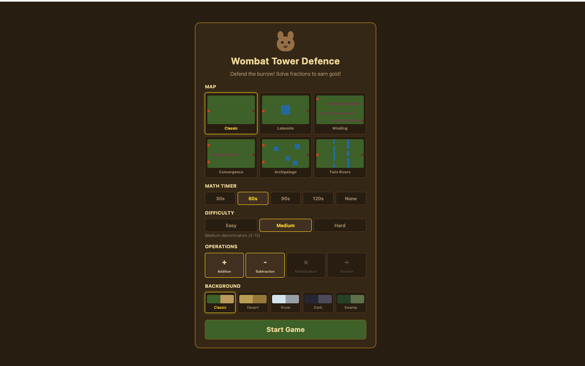
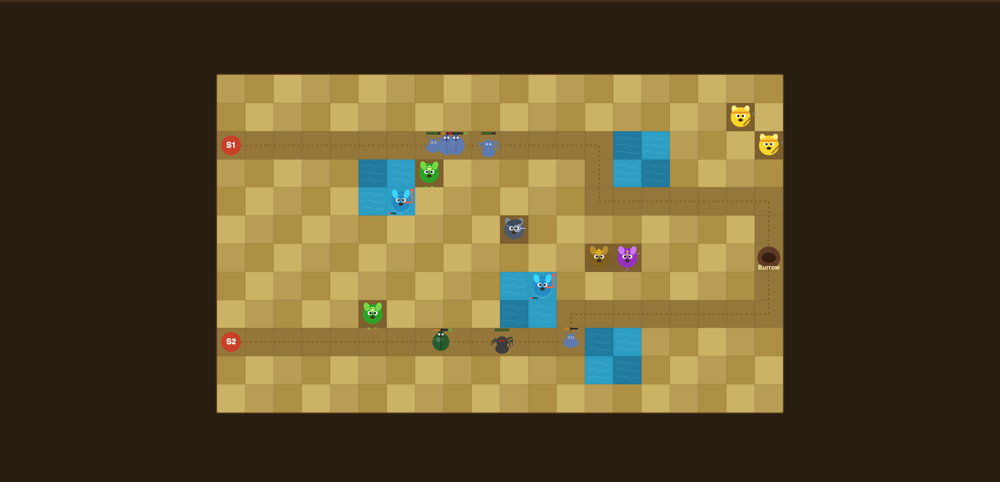
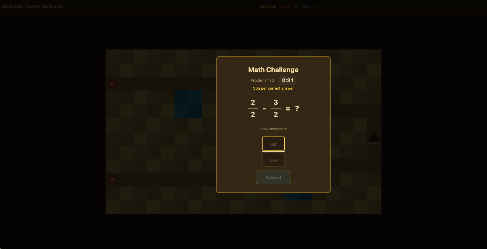
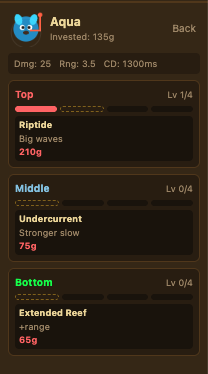

# 🐨 Wombat Tower Defence

A math-based tower defence game built with React + Vite. Defend the wombat burrow by solving fraction problems to earn gold — then spend it on towers to stop the waves of critters.

> Built with the help of [Claude](https://claude.ai) (Anthropic's AI assistant) via Claude Code.

---

## Screenshots

### Main Menu


Choose your map, set a math timer, pick a difficulty, select operations (addition, subtraction, multiplication, division), and pick a background theme before starting.

### Gameplay


Place wombat towers along the path to intercept enemies making their way to the burrow. Multiple enemy types with different speeds, effects, and health keep each wave fresh.

### Math Challenge


When you place finish a playing beating a round, a timed fraction challenge pops up. Solve it correctly to earn gold. Faster answers = more reward.

### Tower Upgrades


Each tower has a unique upgrade tree. Invest gold to boost damage, range, cooldown, and unlock special abilities.

---

## Features

- **6 maps** — Classic, Lakeside, Winding, Convergence, Archipelago, Twin Rivers
- **Fraction math challenges** — addition, subtraction, multiplication, division with configurable difficulty
- **Math timer modes** — 30s, 60s, 90s, 120s, or untimed
- **Multiple enemy types** — each with unique stats and behaviors
- **Tower upgrade trees** — branch upgrades with distinct abilities per tower
- **5 background themes** — Classic, Desert, Snow, Dark, Swamp

---

## Tech Stack

- **React** + **Vite**
- Game loop and state managed in React
- No external game engine — all rendering is DOM/CSS-based

---

## Getting Started

```bash
npm install
npm run dev
```

Then open [http://localhost:5173](http://localhost:5173) in your browser.
